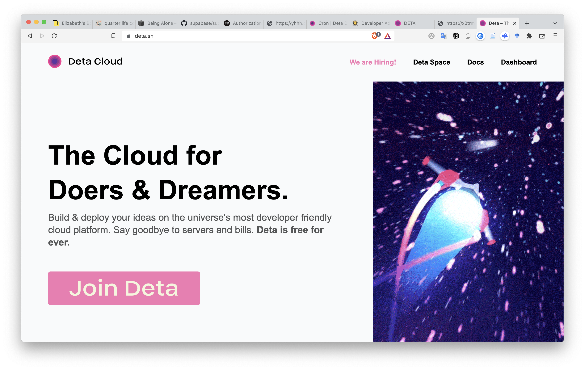

### Playing with [deta.sh](https://www.deta.sh/) 🚀

- `github monitor` folder is a deta app that collects github repo stars when you go to https://star.deta.sh/run

- `github_stars.py` is a python script that put data in Deta Base (credential key is required!)

