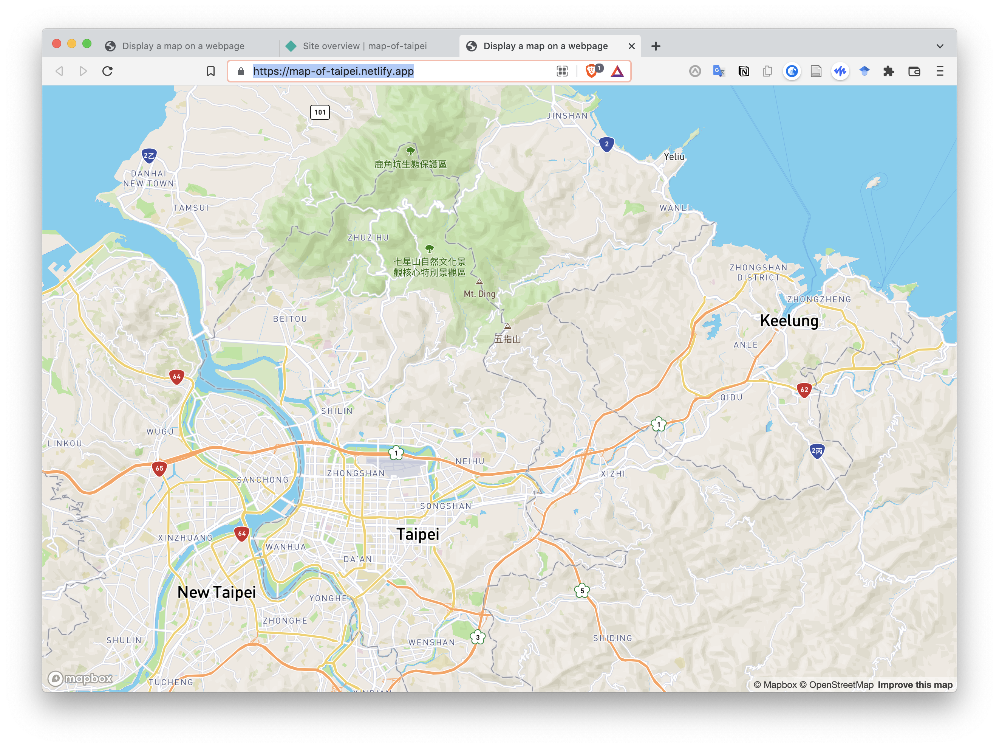

## Mapbox 

Mapbox is a really cool map service. I register an account and make a simple map web page. 

However, because the map require the access token to render, I spent a bit of time figuring out how to host it without exposing my key. 

The working solution is to use Node.js to run the app, but that require node dependency. Now this folder only have vanilla javascript and html, and I try to keep it that way. 

I thought about using envrionment code, or even via a serverless function. But eventually that key will still get exposed if you find the endpoint, just not explicity in the html file. I thought that's not a actual solution. I tried Netlify snippet injection too. 

In all ways, the key will be there if I do not adopt any node envrionment. 

Eventually I just let it go public, since I think the key is not too sensitive. I didn't put credit card with Mapbox so I hope things are fine 🤞 